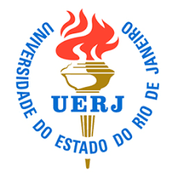

# Final Project - Graduation Files - UERJ / UFRJ / UCAM

Scripts and Data created for final graduation projects and monographes.

Dissertation Thesis data for UERJ / UFRJ / UCAM.

 

## UERJ (University of Rio de Janeiro State)

- Graduation Project: Avaliação Experimental de Protocolos de Transporte em Redes Gigabit
- Degree: Bachelor of Science in Electrical Engineering - Telecommunications Specialization
- Autor: Wallace de Souza Espíndola
- Orientador: Prof. Marcelo Gonçalves Rubinstein
- Coordenador da Disciplina: Prof. Joel Martins de Medeiros
- Location: Rio de Janeiro, Brazil
- Keywords: Redes Gigabit, Protocolos de Transporte, Redes de Computadores, Engenharia Elétrica, Redes de Comunicação, Telecomunicações, Redes de Alta Velocidade, Protocolos de Transporte, Telecom

 

## Poli-UFRJ (Poli-Technical Center - Federal University of Rio de Janeiro)

- Dissertation Thesis: Estudo Comparativo da Performance de Métodos de Requisição e Resposta em Conexões Web
- Degree: Master of Business Administration in Information Technology (MBA IT)
- Autor: Wallace de Souza Espíndola
- Orientador: Heraldo Luís Silveira de Almeida
- Coordenador da Disciplina: Sérgio Palma da Justa Medeiros
- Location: Rio de Janeiro, Brazil
- Keywords: Redes de Computadores, Performance, Redes de Comunicação, Telecom, Redes de Alta Velocidade, Protocolos de
  Transporte, Websockets, HTTP/2, HTTP/3, Requisição e Resposta, Conexões Web, Estudo Comparativo, Engenharia de
  Software

 

## UCAM (Cândido Mendes University)

- Dissertation Thesis: Estudo Comparativo do Uso de Websockets em Conexões Web de Alta Velocidade
- Degree: Specialization in Software Engineering
- Autor: Wallace de Souza Espíndola
- Orientador: Prof. Antônio Muniz
- Location: Rio de Janeiro, Brazil
- Keywords: Redes de Computadores, Alta Performance, Redes de Comunicação, Telecom, Redes de Alta Velocidade, Protocolos
  de Transporte, Websockets, HTTP/2, HTTP/3, Requisição e Resposta, Conexões Web, Alta Velocidade, Estudo Comparativo,
  Engenharia de Software

## Author

- Wallace Espindola, Sr. Software Engineer / Java & Python Dev (B.Sc. in Electrical Engineering)
- **LinkedIn:** [linkedin.com/in/wallaceespindola/](https://www.linkedin.com/in/wallaceespindola/)
- **GitHub:** [github.com/wallaceespindola](https://github.com/wallaceespindola)
- **E-mail:** [wallace.espindola@gmail.com](mailto:wallace.espindola@gmail.com)
- **Twitter:** [@wsespindola](https://twitter.com/wsespindola)
- **Gravatar:** [gravatar.com/wallacese](https://gravatar.com/wallacese)
- **Dev Community:** [dev.to/wallaceespindola](https://dev.to/wallaceespindola)
- **DZone Articles:** [DZone Profile](https://dzone.com/users/1254611/wallacese.html)
- **Pulse Articles:** [LinkedIn Articles](https://www.linkedin.com/in/wallaceespindola/recent-activity/articles/)
- **Website:** [W-Tech IT Solutions](https://www.wtechitsolutions.com/)
- **Presentation Slides:** [Speakerdeck](https://speakerdeck.com/wallacese)

## License

- This project is released under the MIT License. 
- See the [LICENSE](LICENSE) file for details.
- Copyright © 2025 [Wallace Espindola](https://github.com/wallaceespindola/).
